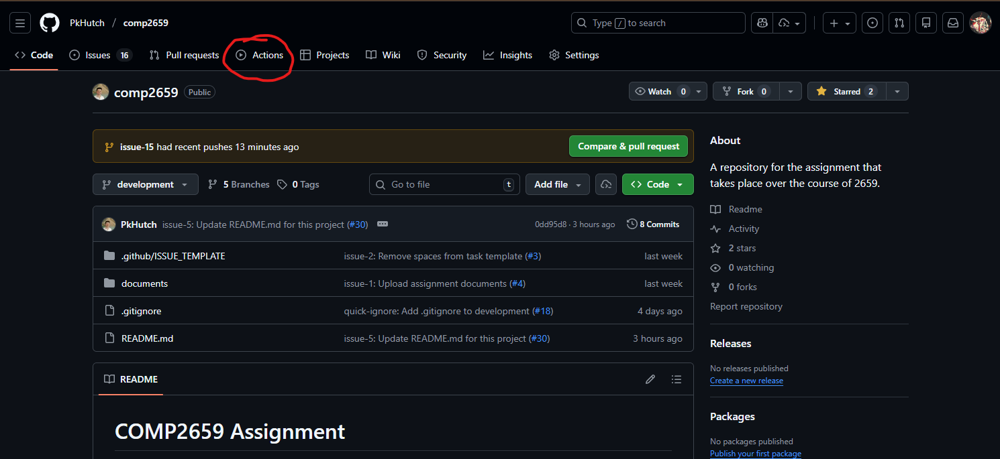
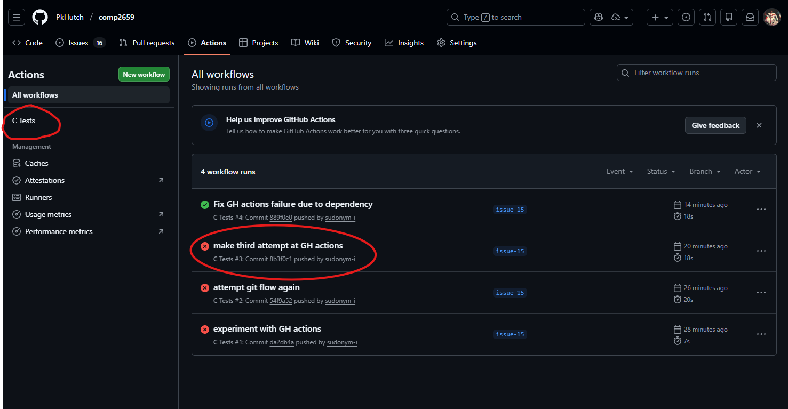
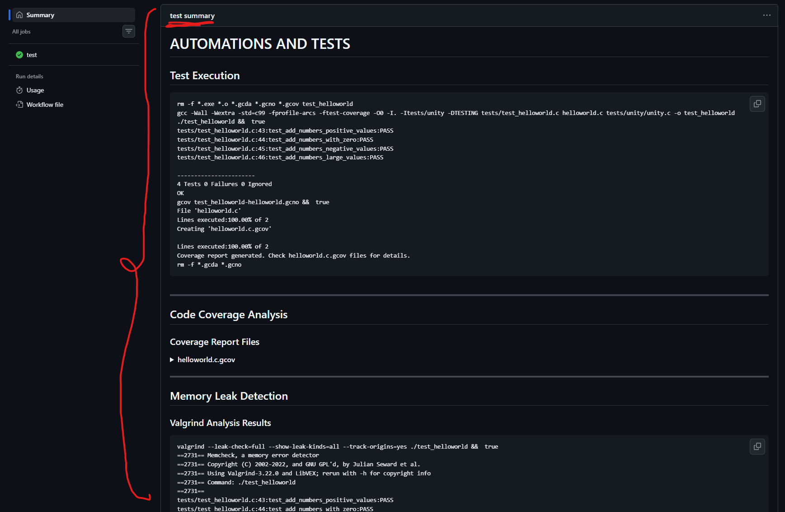

# COMP2659 Assignment
Made for the final project/overall project of COMP2659 at Mount Royal University. The specifications will be listed [here](https://docs.google.com/document/d/1sgGgx19n0Oh4ml2uCEyvfwX6mpvj2tBK_8uIYWLluds/edit?usp=sharing) for now, but will likely be moved into another file in this directory. 

## Structure
* [documents](documents): Assignment handouts.
* [src](src): Source code for the project.

## Testing

*Tests should be run automatically through GitHub action when you push / submit pull requests.*

**If you get a green check-mark:**

this means that you are passing all tests (You're good to go :) ).

**If you get a red x:**

This means that 1 or more tests failed. To see the output of the tests that were run (and where your submission failed), click on the **actions** section,

Then click on your test that failed (likely the **top** test with a **red x beside it**). 

Scroll down to the **"Automations and Tests"** section.

This section will include all of your:
- tests, [*pass/fail*]

```
-----------------------
4 Tests 0 Failures 0 Ignored
```

- Code coverage, [*given as a percentage*]
```
File 'helloworld.c'
Lines executed:100.00% of 2
```

- valgrind memory leak result, [*the output will tell you whether or not there were memory leaks found in while running tests*]
```
==2731== 
==2731== HEAP SUMMARY:
==2731==     in use at exit: 0 bytes in 0 blocks
==2731==   total heap usage: 10 allocs, 10 frees, 18,019 bytes allocated
==2731== 
==2731== All heap blocks were freed -- no leaks are possible
==2731== 
```

**If no test is performed,** or nothing pops up- you are likely merging into a branch that does not require/ have the tests automated for it.👾

Contributors: [@emykh268](https://github.com/emykh268), [@PkHutch](https://github.com/PkHutch), [@rileygramlich](https://github.com/rileygramlich), [@sudonym-i](https://github.com/sudonym-i)
