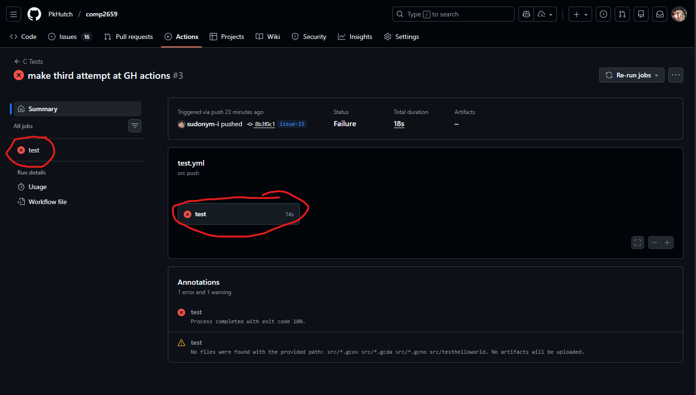
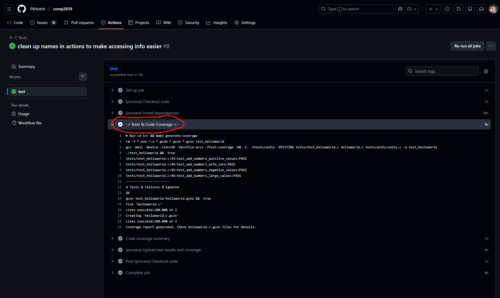

# COMP2659 Assignment
Made for the final project/overall project of COMP2659 at Mount Royal University. The specifications will be listed [here](https://docs.google.com/document/d/1sgGgx19n0Oh4ml2uCEyvfwX6mpvj2tBK_8uIYWLluds/edit?usp=sharing) for now, but will likely be moved into another file in this directory. 

## Structure
* [documents](documents): Assignment handouts.
* [src](src): Source code for the project.

## Testing

*Tests should be run automatically through GitHub action when you push / submit pull requests.*

**If you get a green check-mark:**

this means that you are passing all tests (You're good to go :) ).

**If you get a red x:**

This means that 1 or more tests failed. To see the output of the tests that were run (and where your submission failed), click on the **actions** section,

Then either click on your test that failed (likely the top test) *or* the *"C tests"* section, 

Click on either "Test" button,

And expand the *"-> Tests & Code Coverage <-"* row to see detailed information on the various tests that passed/failed (along with code coverage)

**If no test is performed,** or nothing pops up- you are likely pushing / merging into a branch that does not require/ have the tests automated for it.

Contributors: [@emykh268](https://github.com/emykh268), [@PkHutch](https://github.com/PkHutch), [@rileygramlich](https://github.com/rileygramlich), [@sudonym-i](https://github.com/sudonym-i)
