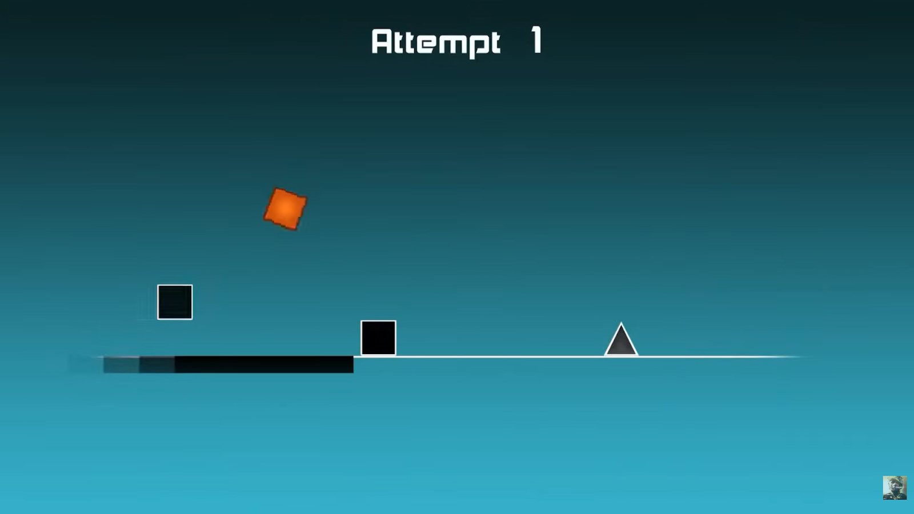
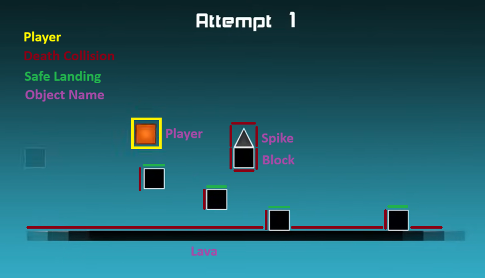
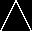

# Detailed Game Specification: Geometry Dash

|               |                        |
|:--------------|:-----------------------|
| Course        | COMP 2659, Winter 2026 |
| Instructor    | Nolan Shaw             |
| Author(s)     | Robert Parker Hutcheson (201762335), Isaac Klein (201763977), Riley Gramlich (201762060), Eduard Mykhailets |
| Last Modifie| January 28th, 2026     |

## 1. General Game Overview:

&emsp; Geometry Dash is a single-player, platforming, side-scroller game that involves a square (named “Geo”) moving through an obstacle-filled level. The game is viewed from the side, and the entire screen represents a 2-D course that scrolls continuously to the right. The player controls Geo as they move through the level automatically; the player does not control their speed or direction, only when they jump. The objective of the game is to reach the end of the level without “dying”. Geo “dies” when they collide with a hazard: a spike, obstacle, or lava. At this point the attempt ends and the level restarts from the beginning.  

&emsp; Current repository state: the codebase implements a single-player prototype with one playable level. Some later sections below describe intended features that are not yet implemented.

  
Figure 1: Shows Geo mid-jump as they clear a gap, with a spike ahead on the track that must be jumped over next.  
Source: [1]

## 2. Game Play Details for Core 1-Player Version

### Objectives and Rules:

&emsp; The player, Geo, is confronted with a static level consisting of obstacles. The level is traversed from left to right. Geo is unable to control the rate at which they traverse the level; their horizontal velocity (dx) is held constant for the entire game. Player input is granted through the spacebar, which causes Geo to jump. Upon jumping, Geo will fall back down until encountering the ground or a platform. Geo will be unable to jump until they have landed onto a surface and is no longer in the air. The player must get Geo to jump throughout the course of the game to avoid obstacles until they either die or beat the level.  
&emsp;Obstacles consist of blocks, spikes, and lava. If spikes or lava are touched, Geo dies. If a block is landed on, that is the new floor until the Geo proceeds past the block. If Geo collides with a block from the left or bottom, i.e. he doesn't land on top, they die. If Geo is not on a block, then the floor is the ground.  
&emsp; Once Geo has jumped through the static level and made it to the end of the scrolling platform, the current implementation marks the level as complete and ends the run. The codebase does not yet advance to a next level or return to a main menu after completion.  
&emsp; If the player wins, there is no “score,” they play until they win.  
&emsp; When the player dies, they restart the level.  
&emsp; When a player restarts the level, they start at the left-most position in the world coordinates (player_x = 0 and player_y = 50, subject to change).  
&emsp; Each level will not be detailed here, as it would be a series of hundreds of x/y values of obstacles. Furthermore, the physics will determine what sort of level design will lead to engaging gameplay. However, the levels are static. The current codebase ships with one drafted level rather than a full level set.  

  
Figure 2: Annotated screenshot showing the objects present in The Impossible Game  
Source: Adapted from [1]

### Objects:

| Object Name | Properties | Behaviours | Graphical Image |
| :---------- | :--------- | :--------- | :-------------- |
| Block | • (int) x: The x position of the top left of the object   • (int) y: The y position of the top left of the object   • (int[]) const sprite*: The pointer for how to render this entity   • (int) const size: Width and height of this block | N/A |  |
| Spike | • (int) x: The x position of the top left of the object   • (int) y: The y position of the top left of the object   • (int []) const sprite*: The pointer for how to render this entity   • (int) const size: Width and height of this spike   • Note: Spikes are treated as squares in shape at the start | N/A |  |
| Lava | • (int) x: The x position of the starting left of the lava   • (int []) const sprite*: The pointer for how to render this entity   • (int) const size: Width of the lava | N/A | 
| Geo | • (int) x: The x position of the top left of the object   • (int) y: The y position of the top left of the object   • (int) dx: The change of the x position, or horizontal velocity   • (int) dy: The change of the y position, or vertical velocity   • (int) ddy: The change of dy, or vertical acceleration, or gravity   • (int []) const sprite*: The pointer for how to render this entity   • (int) const size: Width and height of the player | • Move, constant movement towards the right (positive x) through the world. This occurs at a constant rate.   • Jump, sets an initial dy, positively, which is then decreased by ddy |  |

### Physics:

&emsp; The game uses a simple physics model focused on vertical movement and collisions.  
&emsp; Geo has a vertical position, y, and vertical velocity, dy. When the player presses the spacebar while on a valid surface, Geo is given a fixed dy. Each frame, gravity is applied to Geo by reducing his vertical velocity by a constant amount. When the vertical velocity reaches zero, Geo transitions from upward motion to downward motion and continues falling until he collides with a surface, setting dy back to 0 if it is something on which geo can land, or death if not.  
&emsp; Geo’s y position is constrained by a minimum and maximum height. The minimum height corresponds to the ground or the current platform surface. The maximum y limits how far upward Geo can travel, the 400 pixel height of the screen.  
&emsp; When Geo collides with the top surface of a block, he lands safely on top, his vertical velocity is set to zero, and the top of the block becomes the new effective ground level. Collisions with the sides of these blocks or with spike obstacles however immediately trigger the death condition.  
&emsp; Our world has “world coordinates” associated with it, and every obstacle/object in this world has a *fixed position* in this coordinate plane. As Geo's *x increases, we bring objects into frame - effectively scrolling objects from right to left (note that Geo remains in a constant position on the screen- only Geo’s x position relative to the world* changes).  
&emsp; No rotational forces, acceleration-based horizontal movement, or friction are simulated. All physics calculations are performed using simple per-frame updates to ensure predictable behavior and consistent gameplay.

### Synchronous Events:

| Event Name | Trigger | Description |
| :--------- | :------ | :---------- |
| Move Obstacles | Every game clock tick | We move objects “player_velocity” pixels to the left of the screen. |
| Move Geo | Every game clock tick. | Geo is moved vertically by “player_dy” pixels, updating Geo's y position on the display. Geo does not move horizontally across the screen. Geo’s “x value” represents his displacement in the world coordinate system, tracking the distance he has travelled through the world. |
| Player Gravity |Every game clock tick | Geo’s y acceleration (“player_dy”) should decrease and pull Geo to the ground or a platform, and should allow Geo to land/stay on platforms until the next jump |

### Asynchronous Events:

| Event Name | Trigger | Description |
| :--------- | :------ | :---------- |
| Jump request | Space bar is depressed | This will set Geo’s vertical velocity (dy) to 10. This will cause him to begin ascending vertically |

### Condition-Based (Cascaded) Events:

| Event Name | Triggering Condition | Description |
| :--------- | :------------------- | :---------- |
| Collision | All objects will be kept to a width / height of 50 pixels, this means it is triggered when:   \| player_x - obstacle_x \| < 50   AND   \| player_y - obstacle_y \| < 50   Note: If we implement better collision for non-square objects, or change the size of objects, this formula will change. | This will trigger to check the sort of collision that occurs, generally speaking a death |
| Collision, sides or bottom | Collision (Cascaded)   AND   player_y <= obstacle_y | Player death (Geo dies) |
| Collision, top | Collision (Cascaded)   AND   player_y > obstacle_y | This will trigger to check if an obstacle is landable |
| Collision, landable | Collision, top (Cascaded)   AND   obstacle.isLandable() | A player will land on the top of the object, and set the floor height to player_x - 50, landed_object is set to this object |
| Collision, not landable | Collision, top (Cascaded)   AND   !obstacle.isLandable() | Player death |
| Reset ground height | Collision, landable (Cascaded) will set the nearest_object, when:   \| player_x - obstacle_x \| > 50 | The floor height is set to the ground height |
| Landed | Floor height = player_y - 50 | A player has landed on a floor, dy = 0 |
| Not Landed | Floor height != player_y - 50 | A player is not touching the floor. |
| Player death | Collision, sides or bottom (Cascaded)   OR   Collision, not landable (Cascaded) | The level is restarted |
| Level complete | player_x = level_finish | The player has completed the level and is navigated back to the main menu / the next level is began depending on if it was the last level |

### Hypothetical Gaming Session:

&emsp; The game begins with Geo positioned slightly away from the left edge of the screen, approximately a quarter of the screen width from the left boundary, resting on the ground at the default floor height. Geo is stationary relative to the screen at the start of the game. The level consists of a predefined sequence of obstacles that approach Geo from the right side of the screen.  
&emsp; As the game starts, the player does not press any keys. Block obstacles begin to appear from the right and move toward Geo at a constant horizontal rate. The player remains at a fixed horizontal position on the screen while on the ground.  
&emsp; After a short time, a raised block approaches Geo. The player presses the space bar once, triggering a jump event. Geo gains an upward vertical velocity and rises to a height several times greater than the height of the block. While airborne, the Geo maintains his horizontal position on the screen as the block moves beneath them.  
&emsp; As gravity pulls Geo downward, he lands on the top surface of the block. Upon landing, the Geo’s vertical velocity is set to zero and the top of the block becomes the new effective floor height. Geo continues forward as the block moves leftward, until eventually Geo moves past the block and falls back to the ground. Eventually, the block moves far enough left that it is no longer shown on screen.  
&emsp; Shortly afterward, a spike appears on the ground ahead. The player delays the jump slightly longer than before and presses the space bar closer to the spike. This jump causes Geo to pass completely over the spike without making contact, landing safely on the ground on the other side.  
&emsp; Later in the level, the player mistimes a jump and collides with the side of an incoming block. This collision triggers a death event, immediately ending the current attempt. The level resets, and Geo is returned to his initial position, at the beginning of the level.  
&emsp; On the next attempt, the player successfully times each jump, landing on blocks when necessary and fully clearing spikes, gaps, and lava. Near the end of the level, a sequence of obstacles requires the player to jump onto a raised platform and then jump again to avoid a final hazard. Geo clears these obstacles and continues forward until reaching the level completion point.  
&emsp; When the player reaches the end of the level without dying, the level completion event is triggered. If additional levels are available, the game transitions to the next level. Otherwise, the player is returned to the main menu, indicating successful completion of the game.

## 3. Game Play Details for Core 2-Player Version

&emsp; The two-player version is not implemented in the current repository. The codebase currently supports a single Geo, a single input path, and a single shared world state.

## 4. Sound Effects:

&emsp; The game uses a small number of sound effects to provide clear feedback for important game events without overwhelming the player.  
&emsp; Background music plays continuously during gameplay. The current build uses a single music track rather than different tracks for each level. The music is rhythmically structured to complement the pacing of the level but does not provide explicit cues for when the player should jump. Gameplay remains fully visual, and successful timing is determined by obstacle positions rather than audio signals.  

| Sound Effect Name | Brief Description | Event which Triggers Playback |
| :---------------- | :---------------- | :---------------------------- |
| Death | A short sound effect is played when Geo dies   Sample: [https://www.youtube.com/watch?v=XuPeF_YCsfE](https://www.youtube.com/watch?v=XuPeF_YCsfE) | Player death (Cascaded) |
| Level complete | A short distinct sound effect is played to indicate success and reinforce level completion before transitioning to the next state of the game   Sample: [https://www.youtube.com/watch?v=bfbFE4Ld848](https://www.youtube.com/watch?v=bfbFE4Ld848) | Level complete (Cascaded) |

## 5. Additional Features (Time Permitting)

- Camera movement vertically so that levels can be "infinitely" tall *Achieved*

## References:

[1] AleXPain24, _“'The Impossible game' - All 5 levels beaten (PC ver.),"_ Youtube, Video, May 15, 2014. Accessed Jan. 18, 2026. Available: [https://www.youtube.com/watch?v=O_U65QkH_EU](https://www.youtube.com/watch?v=O_U65QkH_EU)
